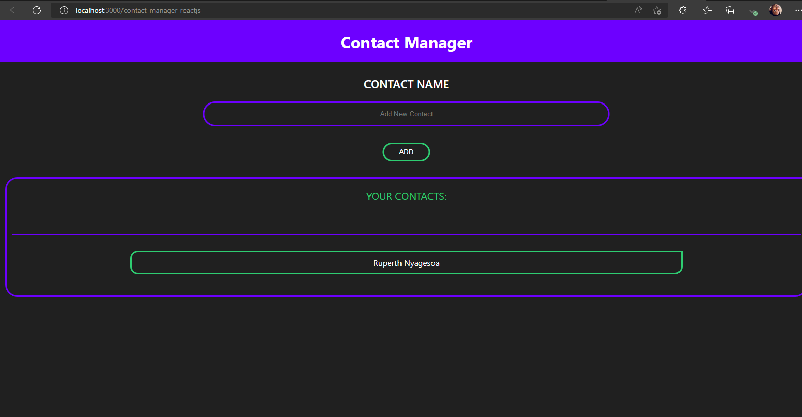

# React-Projects
Contact Manager.

[Visit Now](https://rnr-contactmanager.netlify.app/) 🚀

## 🖥️ Tech Stack
**Frontend:**

&nbsp;
&nbsp;
&nbsp;

**Backend:**

&nbsp;
&nbsp;

**Deployed On:**

//i like this
## Sneak Peek of Home Page 🙈 :

<h2>📬 Contact</h2>

If you want to contact me, you can reach me through below handles.

© 2022 Ruperth Nyagesoa
